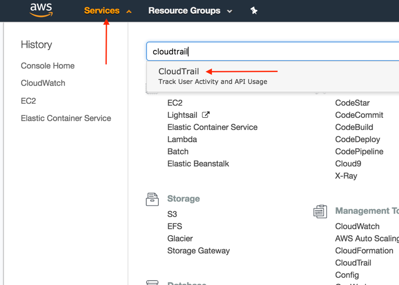
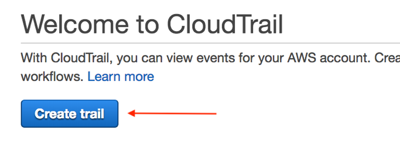
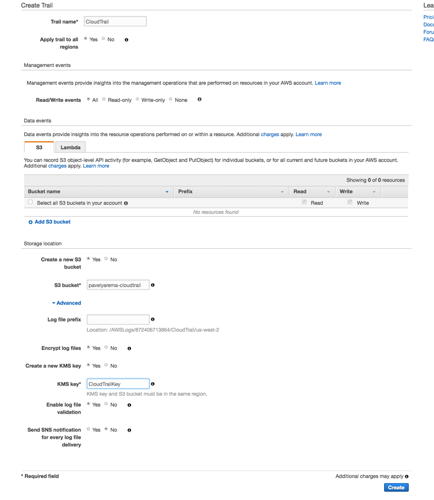
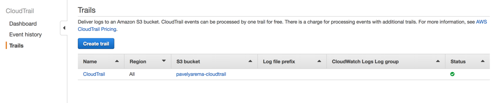
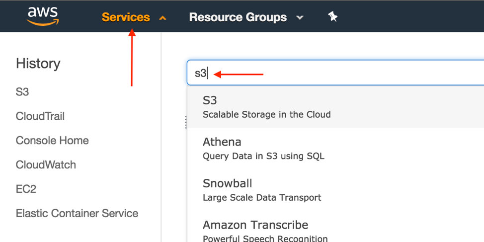
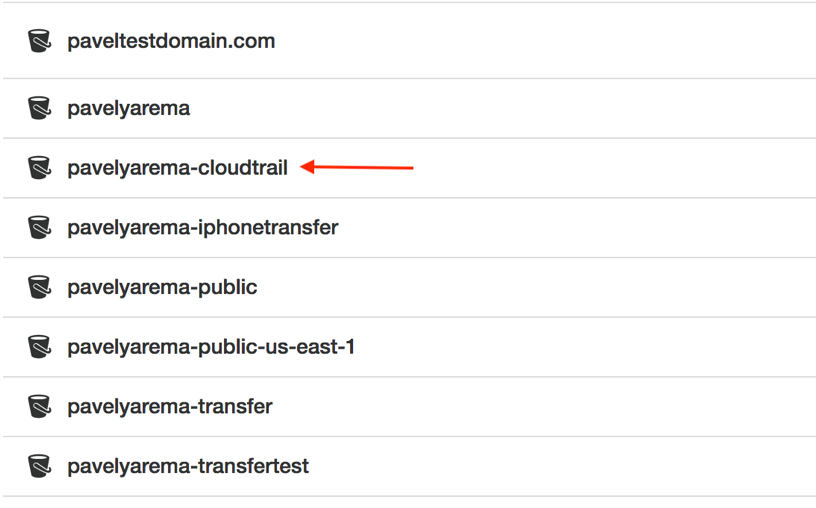
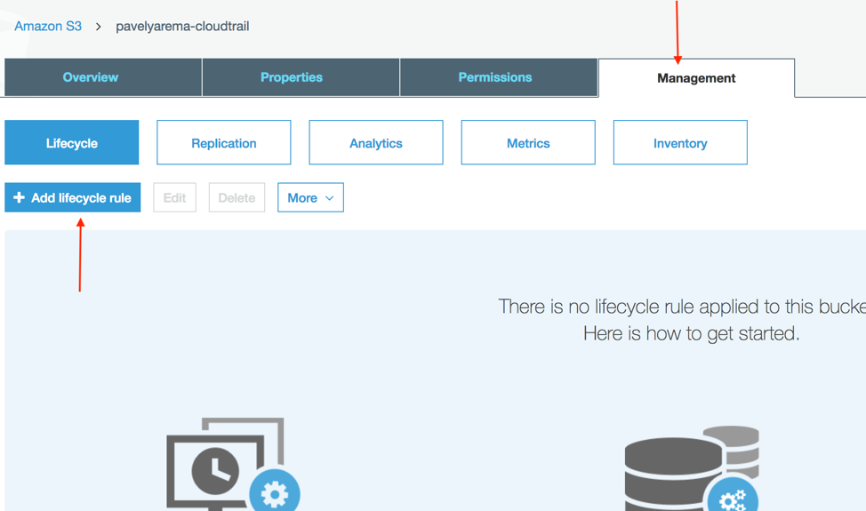
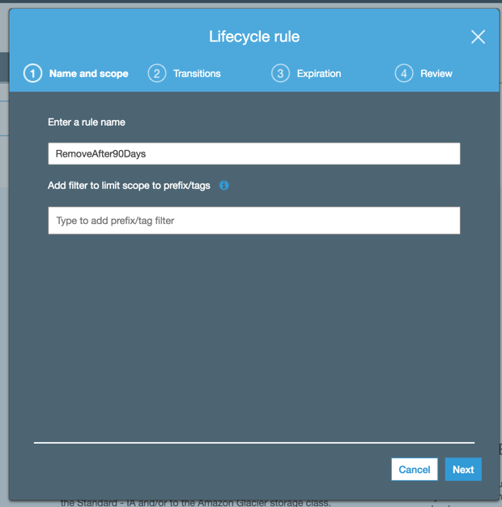
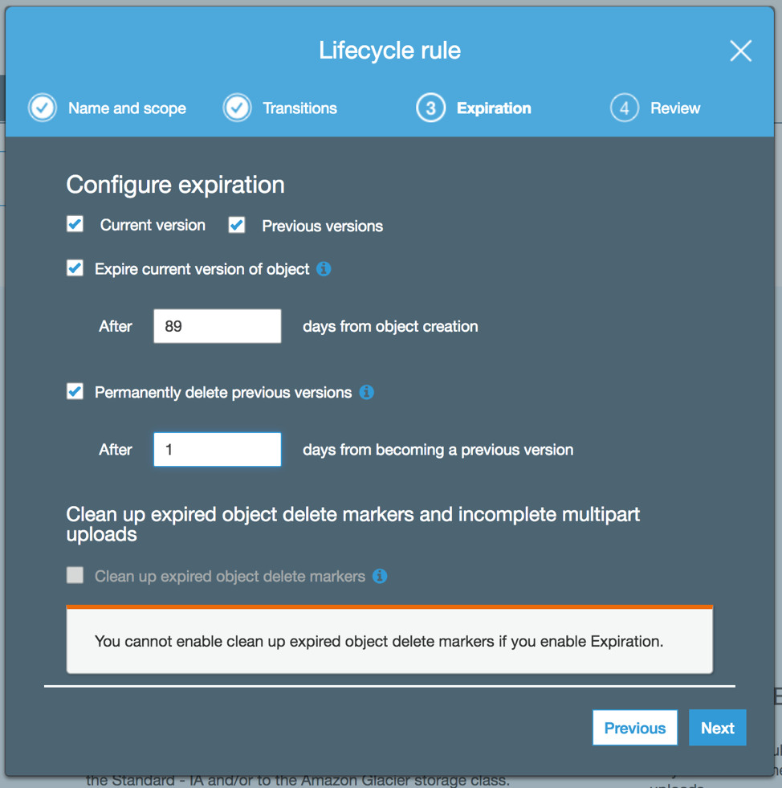
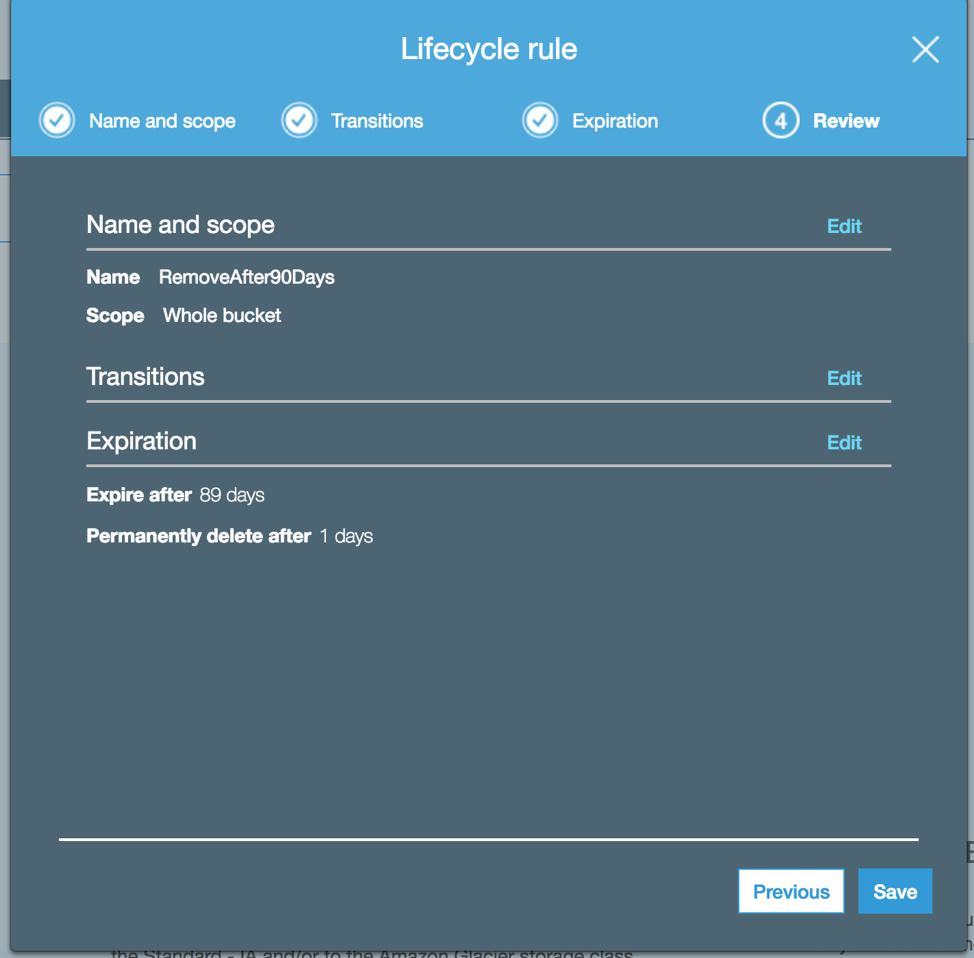

# How to Enable CloudTrail

__Step 1:__ Log into the AWS Account. Click on __Services__ and select __CloudTrail__. 

__Step 2:__ Click on __Create Trail__ button.

__Step 3:__ Enter __Trail name__ along with other fields. For more information, please reference. https://docs.aws.amazon.com/awscloudtrail/latest/userguide/cloudtrail-create-a-trail-using-the-console-first-time.html

Optionally, the trail can be encrypted using either an existing or a new KMS key. Once the fields are filled out, press __Create__ button. 
 

__Step 4:__ Now that Trail has been confirmed. Let see the contents in the S3 bucket. 

__Step 5:__ Click on the __Services__ on the top left corner and select __S3__. Select the bucket that was created in the step 3. 
 

 
__Step 6:__ Click on __Management__ tab and click on the __Add lifecycle rule__ button. 
 

__Step 7:__ Name the lifecycle rule and click __Next__

__Step 8:__ In Transitions tab, just click __Next__. In Expiration tab, select __current version__ and enter a value for the amount of days that should pass before expiring the object (i.e. logfile). Also select previous version and enter the amount of days that should pass after the object is expired before permanently deleting the object (i.e. logfile). In this example, the logfiles expire 89 days after their creation and then deleted 1 day later. Therefore, the logfile will be removed 90 days after its creation. Once the values a configured properly, click __Next__ button. 

__Step 9:__ Review the lifecycle policy and click __Save__. 

 
__Step 10:__ The CloudTrail Trail is now configured. 

