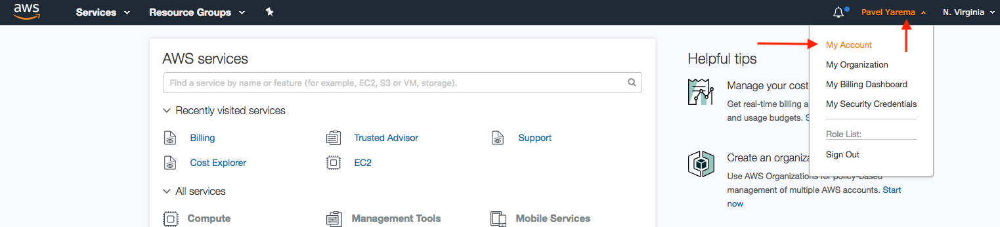
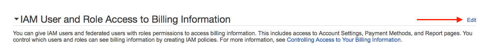
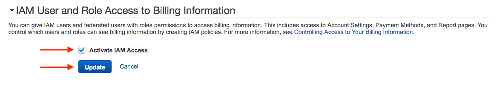

# How to Enable IAM Billing Access 

These instructions were based on the following [AWS documentation](https://docs.aws.amazon.com/awsaccountbilling/latest/aboutv2/grantaccess.html).

__Step 1:__ Log into the AWS account as a root user. 
__Step 2:__ In the top navigation bar, click on the account name and then select __My Account__. 

__Step 3:__ Scroll down until you notice the __IAM User and Role Access to Billing Information__ section. Then click the __Edit__ button    . 

__Step 4:__ Checkmark the __Activate IAM Access__ box and then click __Update__. 

__Step 5:__ Log out of the root account. 
__Step 6:__ Congratulations, now billing information can be viewed by IAM users. Access and permissions to the billing information can be controlled through IAM. For further information, please reference [AWS documentation](https://docs.aws.amazon.com/awsaccountbilling/latest/aboutv2/grantaccess.html).

