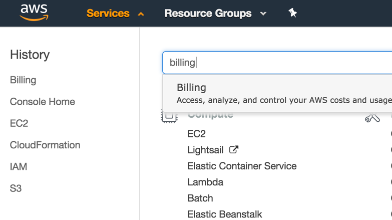
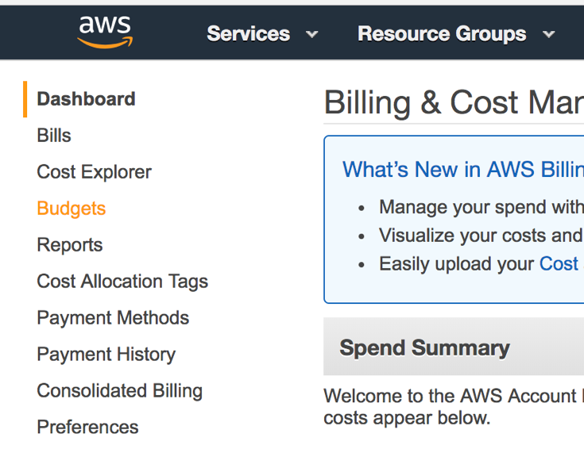
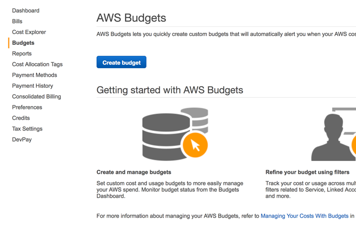
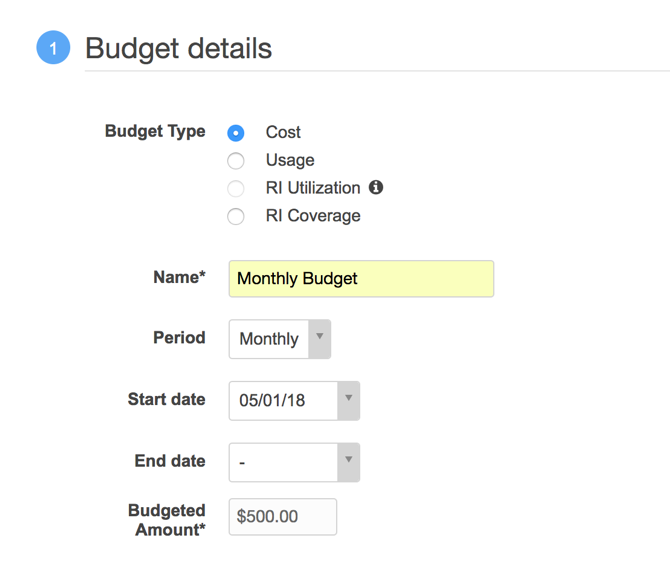
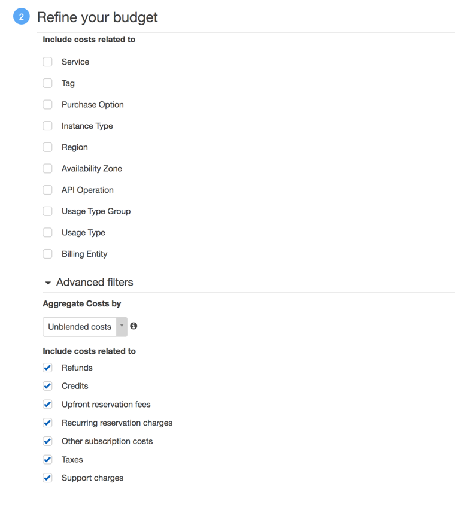
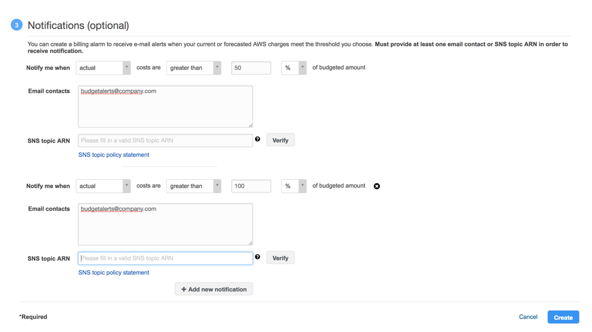
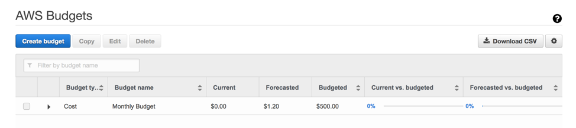

# How to setup budget alerts

These instructions were based on the following [AWS documentation](https:__//docs.aws.amazon.com/awsaccountbilling/latest/aboutv2/budgets-create.html).

__Step 1:__ Log into the AWS Account. Click on __Services__, search and select __Billing__.

__Step 2:__ In the left navigation, select __Budgets__. 

__Step 3:__ Click the __Create budget__ button.

__Step 4:__ In the __Budget details__ section, select the budget type to be __Cost__. Provide a __Name__ for the budget and select the period to be __Monthly__ or any other time interval that best fits your business needs. Also provide budget __Start date__ and __End date__ along with __Budget Amount__ for the time interval. (Please note if you want the budgets to be sent each time interval indefinitely, leave the __End Date__ value blank.) 
 

__Step 5:__ In the Refine your budget section, you have to option to refine your budget to specific parameters and filters. To capture the total cost spend on the account, leave the values as default. 

__Step 6:__ In the notification section, select at which percentage of the budget you want to be alerted and provide an email addresses that should be notified. (You also have the option of selecting a SNS topic). You can add additional notification at various percentage levels. Once everything is configured, press __Create__. 

__Step 7:__ Please verify the email address(es) that were provided during the budget creation process in order to receive alerts. 

__Step 8:__ Congratulations. The budget is now setup in the AWS account. 
 

