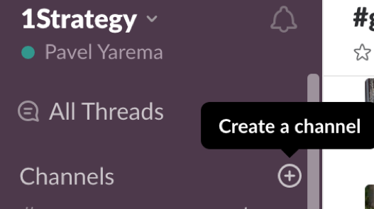
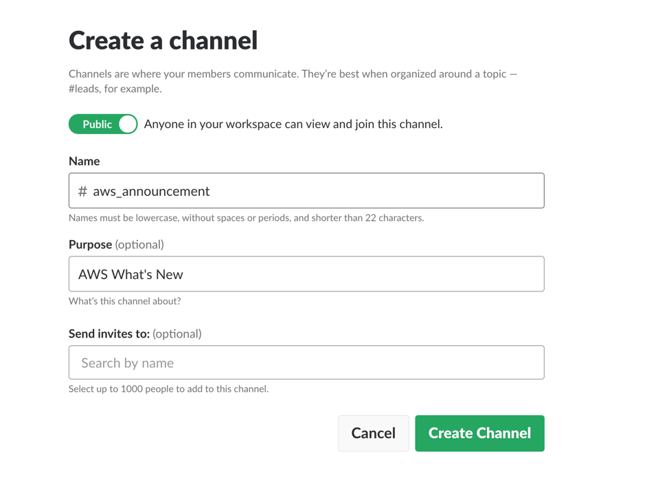
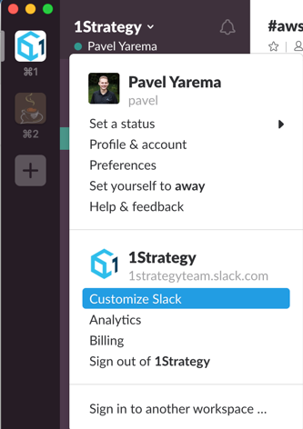
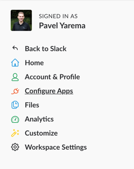
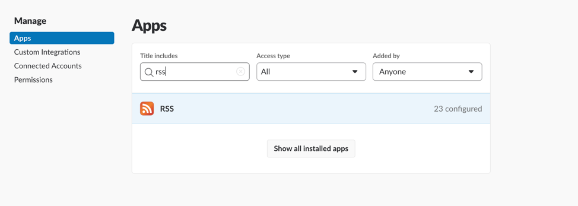
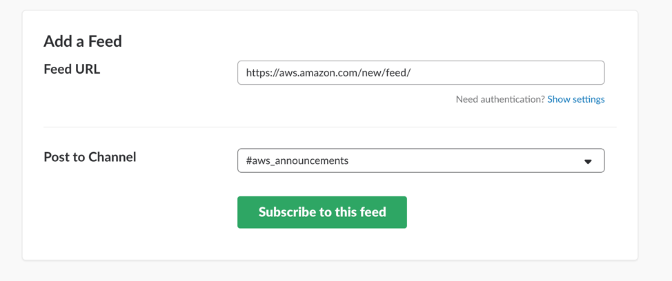
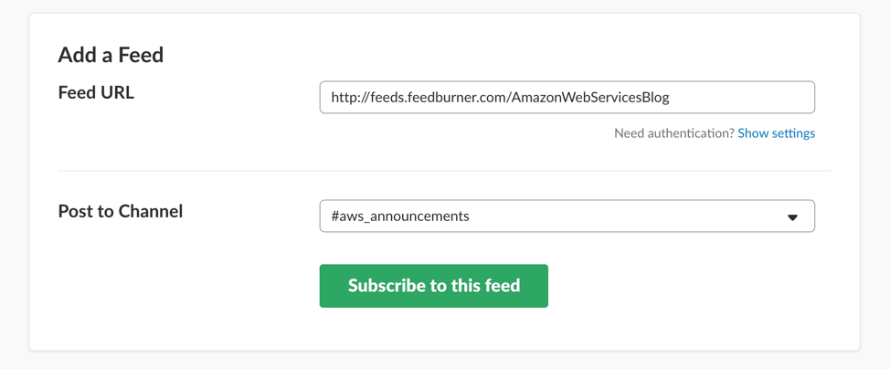
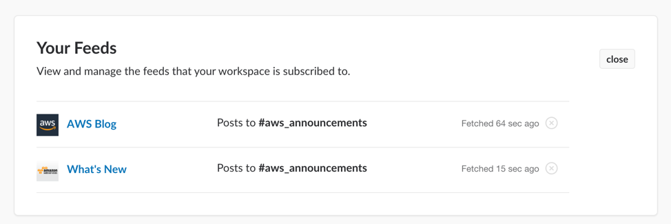
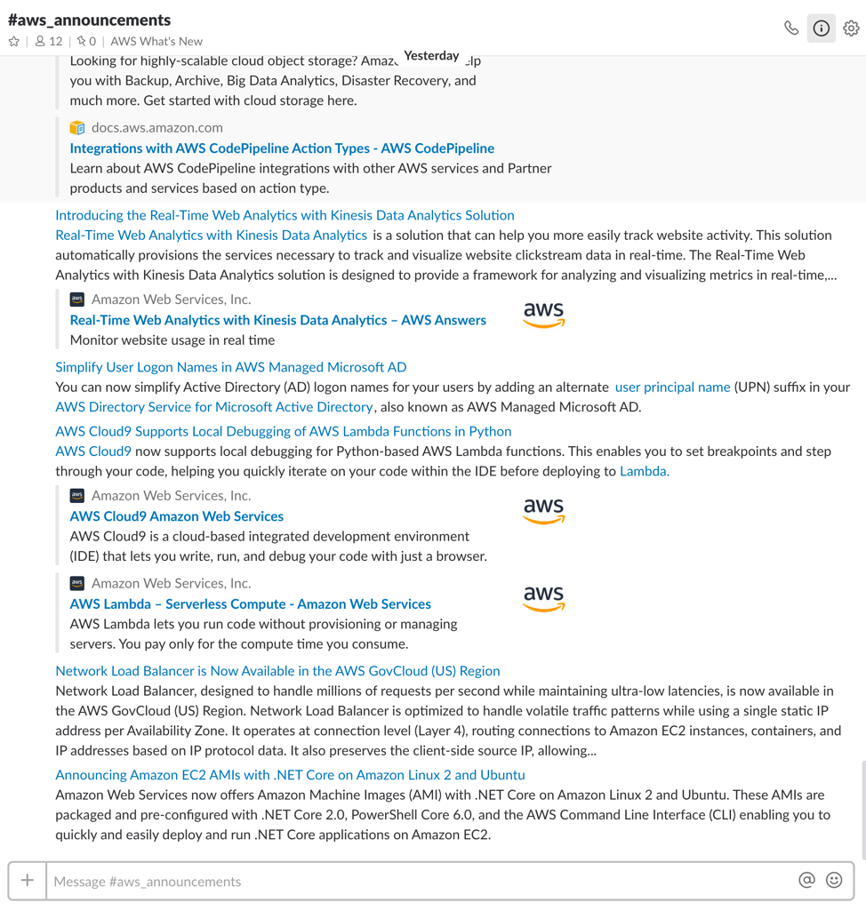

# Create "AWS Announcements" slack channel

__Step 1:__ Open and Sign-into Slack. 

__Step 2:__ Click on the "+" icon next to __Channels__ to create a new channel. 

__Step 3:__ Ensure that the channel is __Public__. Specify the channel name and optionally add a channel description. Once completed, click the __Create Channel__ button. 

__Step 4:__ Next, click on the down-arrow next to your workspace name and select __Customize Slack__. This will open up a browser where you can configure your workspace slack setting. 

__Step 5:__ In the left pane, select __Configure Apps__. Then search for the __RSS__ application and select it.

__Step 6:__ In the __Add a Feed__ section enter the following feed url: 
https://aws.amazon.com/new/feed/. In the "Post to Channel" field, select the newly created channel in Step 3. Then click the __Subscribe to this feed__ button. 

__Step 7:__ Repeat Step 6 by adding the following feed url to the same channel. http://feeds.feedburner.com/AmazonWebServicesBlog

__Step 8:__ Once you subscribe to the feeds you should see them in your configuration. 

 
__Step 9:__ Going back to the slack application you should be able to see the new channel. Congratulations, you successfully setup AWS Announcement slack channel for your workspace. 

